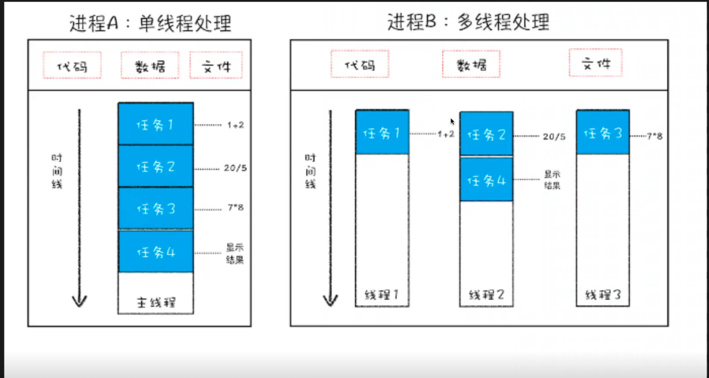

# 浏览器底层原理

- 云操作系统
   - web 程序？
     chrome 足够强的话，可以根据云服务
   - 阿里云 IP 服务 
     一台服务器， 虚拟化、容器化（docker）  
   - LLM 时代， 云 算力资源 共享

- 为什么是Chrome ?
   - 主流
    - chorme 超越IE 浏览器（Edge） 成为NO.1
    - 国内的浏览器 其实就是chrome 套了一层壳
   - 内核
      - IE 和 非 IE box-sizing 不一样 代码兼容性？ 最痛苦的是前端 PC时代
      - 移动时代 ？没IE 什么事情 前端就幸福了
        苹果 webkit 内核 
        google 基于webkit ， 开源了 chromium 的浏览器项目（360等浏览器基于它）
        chrome时chromium的商业版
        - V8 引擎 +渲染引擎
        - webkit 分了叉 升级为 blink 内核

    
   
   - 架构
- 要那么多进程干嘛 ?
  - 进程 是操作系统分配资源的最小单位
  - 线程 是 CPU 调度的最小单位
  
  - JS 是 单线程的 简单 可靠
  - 多线程 更快

- 并行操作 快？

 