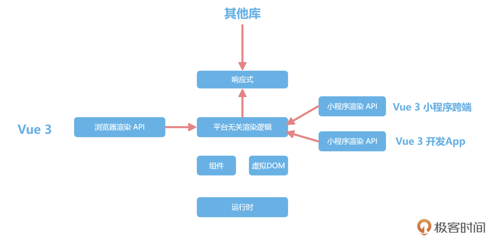
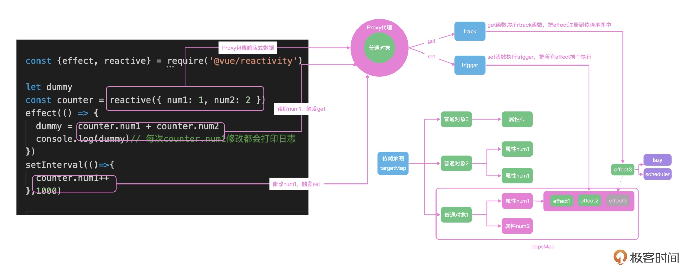

# vue 响应式
- 响应式的原理
- ref/reactive api 
- Proxy vue/react  vue3
- Object.defineProperty vue2
- 手写响应式
-  

## vue 架构
- vue runtime 运行vue的核心代码
- 组件、响应式(mvvm)、虚拟DOM
- 适配各种UI 程序 (网页，小程序、Navtive App)
  平台无关性
- reactive 包装了一个普通对象编程响应对象？

## 响应式机制的主要功能
 可以把普通对象封装成响应式对象，拦截数据的获取和修改操作(proxy get set)，实现依赖数据的自动化更新({{}} ...)
 - 专注于业务
 - 脱离底层DOM 性能提升

 步骤
 - reactive() 封装普通对象
 - proxy 对象的代理
 - 收集依赖(effect)
 - 
