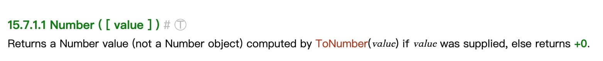
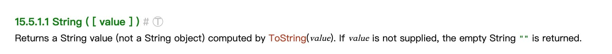

# js 类型转换 

- es6 之前， js 有多少种类型？6 种，
  - 简单数据类型，Primitive , 拷贝式赋值
   - String
   - Number
   - Boolean
   - Null
   - Undefined
  - 复杂数据类型 ， 引用式赋值
   - Object

- 为何JS 类型会改变？
  Number("1")

- JS 是弱类型语言
- 变量的类型 是可以改变的
- 搞清楚变量的确切类型 
  - Primitive 类型 -> 其他类型的转换
   - Boolean
  - Object 类型 -> 其他类型的转换

- Boolean 显示类型转换（构造函数）规则
  - false 的情况 
   - 为空 false
   - false
   - undefined
   - null
   - 0 +0 -0
   - NaN
   - ""
  - true  
  
- +0 -0
    object.is(+0,-0) false
    1/+0 , 1/-0 Infinity -Infinity
- NaN 
    类型仍然是Number,表示一个特殊的数字 not a number

- Number() 
0 1 NaN

- String()
